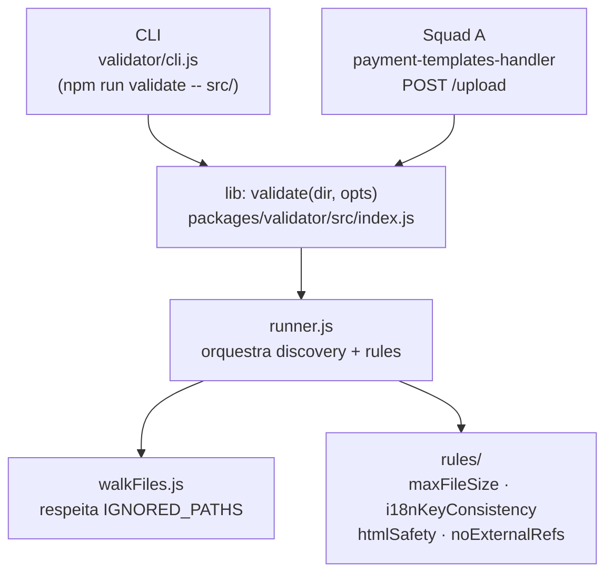

# payment-template-validator

> **Status**: Done
> **Created**: 2026-06-02

## 1. Business Context

### Problem Statement

Parceiros que desenvolvem templates de pagamento para o VTEX Smart Checkout só descobrem erros de validação depois de abrir ticket para a VTEX. Cada ciclo de erro/correção adiciona 5–10 dias úteis ao tempo de release.

Além disso, a validação precisa rodar em dois lugares — CLI local do parceiro e handler server-side da VTEX — e precisa ser a **mesma** validação. Hoje o `payment-templates-handler` (Squad A) não roda validação alguma; se cada lado implementar regras separadas, elas divergem em semanas e o parceiro só descobre em produção.

### Goals

- Parceiro detecta erros de template localmente antes de abrir qualquer ticket.
- VTEX bloqueia uploads inválidos no server usando as mesmas regras do CLI do parceiro.
- Regras novas são adicionadas em um único lugar e propagadas para os dois clientes automaticamente.
- CLI retorna exit code 0/1 adequado para integração em pipelines de CI/CD do parceiro.

### User Stories

#### US-1: Validação local pelo parceiro

- **Story**: Como parceiro de pagamento, quero rodar uma validação local do meu template antes de submetê-lo, para que eu corrija erros sem abrir ticket na VTEX.
- **Acceptance Criteria**:
  - **Given** um diretório de template válido, **when** executo `node validator/cli.js src/`, **then** vejo `✓ template em <dir> passou em todas as validações` e exit code 0.
  - **Given** um template com arquivo maior que 128 KB, **when** executo a CLI, **then** vejo mensagem descritiva de erro e exit code 1.
  - **Given** um template com chaves i18n inconsistentes entre locales, **when** executo a CLI, **then** recebo erro `i18nKeyConsistency` apontando qual arquivo e quais chaves estão faltando.
  - **Given** um template com `<script src="https://external.com/lib.js">`, **when** executo a CLI, **then** recebo erro `noExternalRefs`.
  - **Given** um template com `onclick="evil()"` inline, **when** executo a CLI, **then** recebo erro `htmlSafety`.

#### US-2: Validação em CI/CD do parceiro

- **Story**: Como parceiro, quero integrar a validação no meu pipeline de CI, para que um PR com template inválido seja barrado automaticamente.
- **Acceptance Criteria**:
  - **Given** um template inválido, **when** executo `node validator/cli.js src/ --json`, **then** recebo JSON `{ ok: false, errors: [...] }` e exit code 1.
  - **Given** um template válido, **when** executo com `--json`, **then** recebo `{ ok: true, errors: [] }` e exit code 0.

#### US-3: Consumo da lib pelo handler (Squad A)

- **Story**: Como Squad A, quero consumir a mesma biblioteca de validação usada pela CLI, para que uploads inválidos sejam bloqueados no servidor usando as mesmas regras.
- **Acceptance Criteria**:
  - **Given** um diretório de template no server, **when** Squad A chama `validate(dir)`, **then** recebe `{ ok: boolean, errors: ValidationError[] }`.
  - **Given** a lib retorna `ok: false`, **when** Squad A processa o resultado, **then** o upload é rejeitado com os erros.

### Key Scenarios

| Scenario | Pre-conditions | Steps | Expected Result |
|---|---|---|---|
| Template válido (happy path) | `src/` do payment-mocker sem modificações | `node validator/cli.js src/` | Exit 0, mensagem verde "passou em todas as validações" |
| Arquivo grande demais | Asset > 128 KB no template | CLI contra o diretório | Exit 1, erro `maxFileSize` apontando o total em bytes |
| i18n inconsistente | `i18n/es.json` faltando uma chave que existe em `pt-BR.json` | CLI contra o diretório | Exit 1, erro `i18nKeyConsistency` com chave e arquivo |
| Script externo no HTML | `<script src="https://partner.com/lib.js">` em `payment.html` | CLI contra o diretório | Exit 1, erro `noExternalRefs` apontando a URL |
| Handler inline no HTML | `<button onclick="doEval()">` em `payment.html` | CLI contra o diretório | Exit 1, erro `htmlSafety` |
| Output JSON para CI | Template inválido | `node validator/cli.js src/ --json` | Exit 1, JSON bem-formado com `ok: false` e array `errors` |
| Diretório inexistente | Path inválido passado como argumento | CLI com path que não existe | Exit 2, mensagem de erro descritiva |
| Arquivos dev-env ignorados | `index.html` wrapper, `checkout-style.css`, `assets/libs/` presentes | CLI contra `src/` | `IGNORED_PATHS` excluídos do cálculo; validação não falha por eles |

### Functional Requirements

- **FR-1**: CLI executa sem servidor — `node validator/cli.js <dir>` deve funcionar standalone.
- **FR-2**: Rules implementadas no MVP: `maxFileSize`, `i18nKeyConsistency`, `htmlSafety`, `noExternalRefs`.
- **FR-3**: Cada rule recebe o objeto `template` e retorna `ValidationError[]` — interface plugável.
- **FR-4**: CLI suporta flag `--json` para output estruturado.
- **FR-5**: Exit codes: 0 = válido, 1 = erros de validação, 2 = erro de uso (dir não encontrado, etc).
- **FR-6**: Arquivos de dev-environment (`IGNORED_PATHS`) são excluídos da validação automaticamente.
- **FR-7**: A função `validate(dir, opts?)` da lib retorna `Promise<{ok, errors}>`.

### Non-Functional Requirements

- **NFR-1**: Zero dependências externas além das já presentes — lib roda com Node.js nativo.
- **NFR-2**: Cada rule executa em menos de 500 ms para um template típico (< 1 MB total).
- **NFR-3**: Mensagens de erro em pt-BR, claras o suficiente para o parceiro identificar e corrigir o problema sem auxílio.
- **NFR-4**: CLI é utilizável no GitHub Actions do parceiro sem configuração adicional.

### Out of Scope

- Publicação real no npm como `@vtex/payment-template-validator`.
- Auto-fix (sugestão e aplicação automática de correções).
- Watch mode.
- Configuração via `.validatorrc`.
- i18n nas mensagens de erro (tudo em pt-BR por enquanto).
- Output `--sarif` (GitHub Code Scanning).

---

## 2. Arch Decisions

### Proposed Solution

Extrair a lógica de validação do `validator/cli.js` atual para um módulo standalone em `packages/validator/`, expondo duas interfaces públicas: uma **lib** (consumida pelo Squad A no handler) e a **CLI** existente (que passa a ser um cliente fino da lib). As rules são módulos independentes registrados em `rules/index.js` — Squad B adiciona rules novas sem tocar no runner.

### Architecture Overview



**Fluxo de execução:**
1. Cliente (CLI ou handler) chama `validate(templateDir, opts)`.
2. `runner.js` chama `walkFiles()` para descobrir arquivos (excluindo `IGNORED_PATHS`).
3. `runner.js` monta o objeto `template` (html, css, i18n, icon, assets).
4. Para cada rule registrada, chama `rule(template)` e agrega os erros.
5. Retorna `{ ok: errors.length === 0, errors }`.

### Alternatives Considered

| Alternative | Pros | Cons | Verdict |
|---|---|---|---|
| Manter lógica no `cli.js` e duplicar no handler | Simples, sem refatoração | Regras divergem com o tempo; fonte dupla de bugs | Rejeitado |
| Publicar pacote npm real | Versionamento formal, consumo simples | Overhead de publicação fora do escopo do dojo; path relativo serve | Rejeitado (pós-MVP) |
| Rules assíncronas (`async rule(template)`) | Permite rules com I/O (ex.: fetch externo) | Complexidade desnecessária para MVP; template é local | Rejeitado no MVP |
| Configuração via `.validatorrc` | Flexível para o parceiro | Fora do escopo MVP; adiciona parsing | Rejeitado (pós-MVP) |

### Risks & Mitigations

| Risk | Impact | Likelihood | Mitigation |
|---|---|---|---|
| `IGNORED_PATHS` não cobre todos os arquivos de dev-env | Med | Med | Revisar lista com exemplos reais; aceitar `opts.ignore` para sobrescrever |
| Interface `validate()` diverge antes de Squad A integrar | High | Med | Fixar contrato no design contract (0:10–0:15); Squad A mocka `validate() → {ok:true}` enquanto Squad B implementa |
| CSS com paths relativos (`../../img/`) falha `noExternalRefs` | Med | Low | Rule permite paths relativos explicitamente; documentar decisão |
| i18n com estrutura de diretório diferente do padrão | Low | Med | `readTemplate()` já aceita múltiplos candidatos; documentar convenção |

### Key Decisions

#### Decision 1: Módulo standalone via path relativo, não pacote publicado

- **Status**: Accepted
- **Context**: Squad A precisa consumir a lib, mas publicar no npm adiciona overhead desnecessário no dojo.
- **Decision**: `packages/validator/` com `package.json` próprio, consumido via `require('../packages/validator')` por path relativo.
- **Consequences**: Sem versionamento semântico no MVP; em produção, o caminho natural é publicar como `@vtex/payment-template-validator`.

#### Decision 2: Rules são síncronas no MVP

- **Status**: Accepted
- **Context**: Todas as validações do MVP operam apenas sobre arquivos locais já lidos em memória.
- **Decision**: Assinatura `rule(template) → ValidationError[]` (síncrona). Sem async.
- **Consequences**: Se uma rule futura precisar de I/O (ex.: validar schema contra uma API), a interface precisará ser revisada. Aceitável dado o escopo atual.

#### Decision 3: `validate()` exposta como `async` na API pública da lib

- **Status**: Accepted
- **Context**: Squad A usa `await validate(dir)` no handler; rules são síncronas hoje, mas a assinatura async garante compatibilidade futura sem quebrar clientes.
- **Decision**: `async function validate(dir, opts?) → Promise<{ok, errors}>`. Runner interno é síncrono; wrapper async é a camada pública.
- **Consequences**: Nenhuma penalidade de performance prática; protege a interface para evolução futura.

#### Decision 4: `IGNORED_PATHS` migra para a lib como padrão configurável

- **Status**: Accepted
- **Context**: O CLI atual tem `IGNORED_PATHS` hardcoded. A lib precisa da mesma lista, mas permitir override via `opts.ignore`.
- **Decision**: `IGNORED_PATHS` é exportado como constante padrão da lib; `opts.ignore` faz override completo (não merge) para manter simplicidade.
- **Consequences**: Quem sobrescrever `opts.ignore` precisa reincluir os paths que quer ignorar.

### Implementation Plan

**Fase 1 — Extrair lib (base para as rules novas)**
1. Criar `packages/validator/` com `package.json` (`name: "@vtex/payment-template-validator"`).
2. Mover `walkFiles` e `readTemplate` para `packages/validator/src/runner.js` (ou `walkFiles.js`).
3. Mover `IGNORED_PATHS` para a lib como default configurável.
4. Migrar `maxFileSize.js` para `packages/validator/src/rules/maxFileSize.js`.
5. Criar `packages/validator/src/index.js` expondo `validate(dir, opts)`.
6. Atualizar `validator/cli.js` para consumir a lib (cliente fino).

**Fase 2 — Rules obrigatórias**
7. Implementar `i18nKeyConsistency`.
8. Implementar `htmlSafety`.
9. Implementar `noExternalRefs`.

**Fase 3 — Rule adicional (se banda permitir)**
10. Implementar uma das adicionais: `requiredFiles` (mais simples) ou outra do menu.

**Fase 4 — Integração com Squad A**
11. Squad A substitui mock de `validate()` pela lib real.
12. Smoke test: `node validator/cli.js src/` retorna exit 0.

---

## 3. Technical Contract

### Data Models

```js
// Erro retornado por uma rule
ValidationError = {
  rule: string,        // ex: "maxFileSize"
  message: string,     // humano, pt-BR, ex: "Tamanho total 150000 bytes excede 128KB"
  file?: string,       // arquivo que causou o erro (opcional)
  severity?: "error" | "warning",  // default: "error"
}

// Opções de configuração da lib
ValidateOptions = {
  rules?: string[],        // rodar só subset de rules (por nome)
  ignore?: string[],       // override completo de IGNORED_PATHS
  maxFileSize?: number,    // override do limite padrão (128 * 1024 bytes)
}

// Objeto template passado para cada rule
Template = {
  html:   FileSlot | null,   // partials/payment.html ou payment.html
  css:    FileSlot | null,   // assets/css/less/style.css ou style.css
  i18n:   FileSlot | null,   // i18n/pt-BR.json (slot principal)
  icon:   FileSlot | null,   // assets/img/icon.png
  assets: FileRef[],         // demais arquivos não-slot
}

FileSlot = {
  path: string,              // path absoluto
  size: number,              // bytes
  content: string,           // leitura lazy utf-8
  buffer: Buffer,            // leitura lazy binária
}

FileRef = {
  path: string,
  size: number,
}
```

### Interfaces

**API pública da lib (`packages/validator/src/index.js`)**:

```js
// Valida um diretório de template. Retorna ok=true se nenhuma rule falhou.
async function validate(
  templateDir: string,
  opts?: ValidateOptions
): Promise<{ ok: boolean, errors: ValidationError[] }>

// Registry de rules ativas (para inspeção e testes)
const rules: Array<(template: Template) => ValidationError[]>
```

**Assinatura padrão de cada rule**:

```js
// Recebe o template descoberto, retorna array vazio se OK ou erros encontrados.
function ruleName(template: Template): ValidationError[]
```

**CLI**:

```bash
node validator/cli.js <templateDir> [--json]

# Exemplos:
node validator/cli.js src/           # output humano, exit 0/1
node validator/cli.js src/ --json    # JSON, exit 0/1
node validator/cli.js                # exit 2, instrução de uso
node validator/cli.js /nao/existe    # exit 2, "Diretório não encontrado"
```

**Rules do MVP e suas verificações**:

| Rule | O que verifica | Erro exemplo |
|---|---|---|
| `maxFileSize` | Soma total de bytes ≤ 128 KB | `"Tamanho total 150000 bytes excede 128KB"` |
| `i18nKeyConsistency` | Todos `i18n/*.json` têm o mesmo set de chaves | `"i18n/es.json não tem a chave 'paymentData.paymentGroup.title'"` |
| `htmlSafety` | Sem `<script>` fora de whitelist, sem `eval`, sem `on*=` inline | `"Atributo onclick inline não permitido em <button>"` |
| `noExternalRefs` | Sem URLs externas (`http://`, `https://`) em HTML e CSS | `"URL externa bloqueada: https://partner-cdn.com/pixel.gif"` |

### Integration Points

**Squad A (`payment-templates-handler`)**:
- Consome `validate(uploadedTemplateDir)` no handler de `POST /upload`.
- Pode mockar `validate() → { ok: true, errors: [] }` enquanto Squad B não entrega a lib.
- Após integração, erros com `severity: "error"` bloqueiam o upload; `severity: "warning"` apenas logam.

**Parceiro (CI/CD)**:
- Executa `node validator/cli.js <dir> --json` no GitHub Actions.
- Exit code 1 falha o job; JSON output alimenta ferramentas de relatório.

### Invariants & Constraints

- `IGNORED_PATHS` deve sempre excluir arquivos de dev-environment do payment-mocker: `index.html` (wrapper), `checkout-style.css`, `assets/libs/`, `assets/css/sass/`, `assets/css/less/style.less`.
- Uma rule **nunca** deve lançar exceção — qualquer erro interno deve ser capturado e retornado como `ValidationError` com `severity: "warning"`.
- `validate()` retorna `ok: false` se e somente se houver pelo menos um erro com `severity: "error"`.
- Exit code 2 é reservado exclusivamente para erros de invocação (args ausentes, diretório inexistente) — nunca para erros de validação de template.
- Paths relativos (`./img/logo.png`, `logo.png`) e `data:` URIs são sempre permitidos pela rule `noExternalRefs`.
