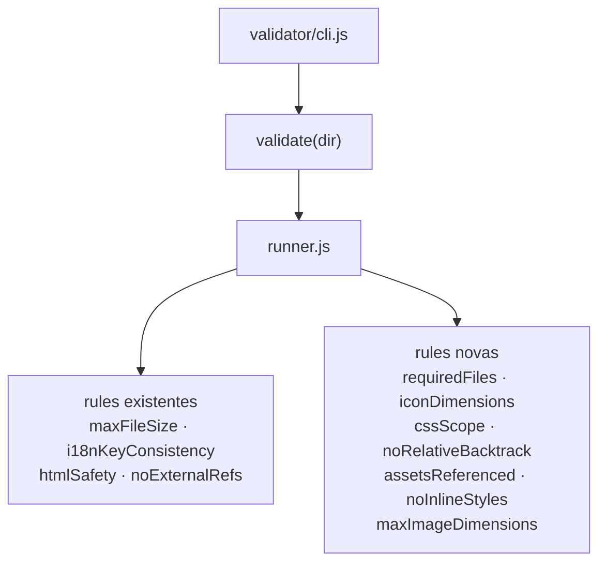

# validator-rules-expansion

> **Status**: Done
> **Created**: 2026-06-02

## 1. Business Context

### Problem Statement

O `payment-template-validator` atual tem 4 rules que cobrem os riscos mais críticos, mas deixa lacunas que causam problemas reais em produção: uploads incompletos chegam ao servidor sem feedback útil, ícones com dimensões absurdas quebram o layout do checkout, CSS sem escopo destrói a página inteira dos lojistas, paths relativos que funcionam em dev explodem no servidor, assets com typo de nome geram 404 silencioso, e estilos inline bloqueiam o sistema de customização do checkout.

### Goals

- Parceiro recebe mensagem de erro acionável para cada um dos 7 novos tipos de problema antes de abrir ticket.
- Uploads incompletos, CSS fora de escopo e referências quebradas são bloqueados no servidor (Squad A) pelas mesmas rules.
- Zero dependências externas adicionadas — todas as rules usam Node.js nativo.

### User Stories

#### US-1: requiredFiles

- **Story**: Como parceiro, quero saber imediatamente se esqueci de incluir um arquivo obrigatório, para que o upload não seja rejeitado pelo servidor sem explicação.
- **Acceptance Criteria**:
  - **Given** um template sem `payment.html`, **when** executo a CLI, **then** recebo erro `requiredFiles` apontando qual arquivo está faltando.
  - **Given** um template sem nenhum arquivo `i18n/pt-BR.json`, **when** executo a CLI, **then** recebo erro `requiredFiles` para o i18n.
  - **Given** um template sem ícone (`icon.png`), **when** executo a CLI, **then** recebo erro `requiredFiles` para o ícone.
  - **Given** um template com todos os arquivos obrigatórios presentes, **when** executo a CLI, **then** `requiredFiles` não gera erros.

#### US-2: iconDimensions

- **Story**: Como parceiro, quero ser avisado se meu ícone tem dimensões inadequadas, para que o layout do checkout não quebre.
- **Acceptance Criteria**:
  - **Given** um ícone PNG com largura ou altura > 200px, **when** executo a CLI, **then** recebo erro `iconDimensions` com as dimensões encontradas e o limite.
  - **Given** um ícone PNG com largura ou altura < 40px, **when** executo a CLI, **then** recebo erro `iconDimensions` indicando que é muito pequeno.
  - **Given** um ícone PNG dentro do intervalo [40px, 200px], **when** executo a CLI, **then** nenhum erro.
  - **Given** um template sem ícone, **when** executo a CLI, **then** `iconDimensions` não gera erro (delegado ao `requiredFiles`).

#### US-3: cssScope

- **Story**: Como VTEX, quero garantir que o CSS do parceiro não vaze para fora do escopo do template, para que o checkout dos lojistas não seja afetado.
- **Acceptance Criteria**:
  - **Given** CSS com `body { background: red }`, **when** executo a CLI, **then** recebo erro `cssScope` apontando o seletor problemático.
  - **Given** CSS com `[data-payment-template] .btn { color: blue }`, **when** executo a CLI, **then** nenhum erro.
  - **Given** CSS com `@media (max-width: 768px) { [data-payment-template] .btn { ... } }`, **when** executo a CLI, **then** nenhum erro.
  - **Given** CSS com `@keyframes` ou `@font-face`, **when** executo a CLI, **then** nenhum erro (at-rules são isentos).

#### US-4: noRelativeBacktrack

- **Story**: Como parceiro, quero ser avisado se meu CSS usa paths `../..` que funcionam em dev mas quebram no servidor, para que eu corrija antes do upload.
- **Acceptance Criteria**:
  - **Given** CSS com `url('../../img/logo.png')`, **when** executo a CLI, **then** recebo erro `noRelativeBacktrack` apontando o path.
  - **Given** CSS com `url('./img/logo.png')` ou `url('/img/logo.png')`, **when** executo a CLI, **then** nenhum erro.
  - **Given** CSS sem nenhum `url()`, **when** executo a CLI, **then** nenhum erro.

#### US-5: assetsReferenced

- **Story**: Como parceiro, quero saber se algum asset está com o nome errado ou nunca é usado, para que não haja 404 em produção nem arquivos desnecessários no upload.
- **Acceptance Criteria**:
  - **Given** HTML com `` mas o arquivo é `logo.png`, **when** executo a CLI, **then** recebo erro `assetsReferenced` indicando referência quebrada.
  - **Given** um arquivo `banner.png` presente mas nunca referenciado em HTML ou CSS, **when** executo a CLI, **then** recebo warning `assetsReferenced` indicando asset órfão.
  - **Given** todos os assets referenciados e todos os arquivos usados, **when** executo a CLI, **then** nenhum erro.
  - **Given** referências a paths externos (`https://...`) ou `data:` URIs, **when** executo a CLI, **then** ignorados (já cobertos por `noExternalRefs`).

#### US-6: noInlineStyles

- **Story**: Como VTEX, quero bloquear `style="..."` inline no HTML do parceiro, para que o sistema de temas do checkout consiga sobrescrever estilos sem conflitos de especificidade.
- **Acceptance Criteria**:
  - **Given** HTML com `<div style="color: red">`, **when** executo a CLI, **then** recebo erro `noInlineStyles`.
  - **Given** HTML sem atributos `style=`, **when** executo a CLI, **then** nenhum erro.
  - **Given** HTML com `<style>` block (não atributo), **when** executo a CLI, **then** nenhum erro (coberto por `htmlSafety` se necessário).

#### US-7: maxImageDimensions

- **Story**: Como parceiro, quero ser avisado se alguma imagem tem dimensões físicas excessivas, para que o layout do checkout não quebre mesmo que o arquivo seja pequeno em KB.
- **Acceptance Criteria**:
  - **Given** um PNG com 3000×1000px nos assets, **when** executo a CLI, **then** recebo erro `maxImageDimensions` apontando o arquivo e as dimensões.
  - **Given** todos os PNGs com dimensões ≤ 2000×2000px, **when** executo a CLI, **then** nenhum erro.
  - **Given** um arquivo que não é PNG (ex: `.svg`, `.jpg` não suportado), **when** executo a CLI, **then** ignorado sem erro.

### Key Scenarios

| Scenario | Pre-conditions | Steps | Expected Result |
|---|---|---|---|
| Template completo e válido (happy path) | Todos os arquivos obrigatórios presentes, ícone 80×80px, CSS scoped, sem backtrack, todos assets referenciados | `node validator/cli.js src/` | Todas as 7 novas rules retornam ✓ |
| Upload incompleto sem payment.html | Template sem `partials/payment.html` nem `payment.html` | CLI contra o diretório | Erro `requiredFiles`: "payment.html não encontrado" |
| Ícone gigante | `icon.png` de 4000×4000px | CLI contra o diretório | Erro `iconDimensions`: "4000×4000px excede 200px" |
| CSS vazando escopo | `body { margin: 0 }` no style.css | CLI contra o diretório | Erro `cssScope`: seletor "body" não está dentro de `[data-payment-template]` |
| Path de backtrack no CSS | `url('../../assets/img/bg.png')` | CLI contra o diretório | Erro `noRelativeBacktrack` apontando o path |
| Typo de asset no HTML | `` mas arquivo é `logo.png` | CLI contra o diretório | Erro `assetsReferenced`: referência quebrada para "logoo.png" |
| Asset órfão | `banner.png` presente mas não referenciado | CLI contra o diretório | Warning `assetsReferenced`: "banner.png" nunca referenciado |
| Inline style no HTML | `<div style="color:red">` | CLI contra o diretório | Erro `noInlineStyles` |
| PNG com dimensão excessiva | `background.png` de 3000×500px nos assets | CLI contra o diretório | Erro `maxImageDimensions` |
| Template do payment-mocker padrão | `src/` sem modificações | CLI contra `src/` | Todas as novas rules passam (exit 0) |

### Functional Requirements

- **FR-1**: Cada rule segue a assinatura `function rule(template, opts) => ValidationError[]` com `rule.ruleName` e `rule.describe(template)`.
- **FR-2**: `requiredFiles` verifica presença de: HTML (`partials/payment.html` ou `payment.html`), i18n default (`i18n/pt-BR.json`), ícone (`assets/img/icon.png` ou `icon.png`).
- **FR-3**: `iconDimensions` lê dimensões via header PNG binário (IHDR chunk, bytes 16–23). Limites default: min 40px, max 200px, configuráveis via `opts.iconMinDimension` / `opts.iconMaxDimension`.
- **FR-4**: `cssScope` detecta seletores top-level que não contêm `[data-payment-template]`. At-rules (`@media`, `@keyframes`, `@font-face`, `@import`) são isentas no nível raiz; seus seletores filhos são verificados.
- **FR-5**: `noRelativeBacktrack` bloqueia qualquer `url(` com `..` no path em CSS.
- **FR-6**: `assetsReferenced` coleta referências de `src=` e `href=` no HTML e `url()` no CSS, cruza com a lista de assets do template. Referência a arquivo inexistente = `error`; arquivo presente mas não referenciado = `warning`.
- **FR-7**: `noInlineStyles` bloqueia qualquer atributo `style=` no HTML.
- **FR-8**: `maxImageDimensions` lê dimensões de arquivos `.png` em `template.assets` via IHDR. Limite default: 2000px em qualquer dimensão, configurável via `opts.maxImageDimension`. Outros formatos são ignorados.
- **FR-9**: Todas as rules devem passar quando rodadas contra `src/` do payment-mocker sem modificações.

### Non-Functional Requirements

- **NFR-1**: Zero dependências externas — leitura de PNG via `Buffer` nativo do Node.js.
- **NFR-2**: `assetsReferenced` deve completar em menos de 1s para templates com até 50 arquivos.
- **NFR-3**: Mensagens de erro em pt-BR com informação suficiente para o parceiro corrigir sem auxílio.

### Out of Scope

- Suporte a formatos de imagem além de PNG para leitura de dimensões (JPEG, WebP, SVG).
- `cssScope` não faz parse completo de CSS — usa heurística de regex; CSS minificado pode gerar falso positivo.
- `assetsReferenced` não resolve CSS calc(), variáveis ou referências dinâmicas geradas por JS.
- Auto-fix de qualquer um dos erros.

---

## 2. Arch Decisions

### Proposed Solution

Adicionar 7 arquivos em `packages/validator/src/rules/`, cada um com a assinatura padrão já estabelecida, e registrá-los em `rules/index.js`. Usar o skill `.agents/add-validator-rule.md` como guia de implementação para cada rule. Sem novas dependências.

### Architecture Overview



**Leitura de dimensões PNG** (usada por `iconDimensions` e `maxImageDimensions`):
```
PNG header: 8 bytes signature
IHDR chunk: 4 bytes length + 4 bytes "IHDR" + 4 bytes width + 4 bytes height + ...
Width:  buffer.readUInt32BE(16)
Height: buffer.readUInt32BE(20)
```

### Alternatives Considered

| Alternative | Pros | Cons | Verdict |
|---|---|---|---|
| Usar `sharp` ou `jimp` para leitura de imagem | Suporte a múltiplos formatos, API simples | Dependência externa pesada (~50MB), viola NFR-1 | Rejeitado |
| Implementar parser CSS completo para `cssScope` | Precisão total | Complexidade alta, fora do escopo do dojo | Rejeitado — heurística regex é suficiente para MVP |
| `assetsReferenced` como `warning` apenas | Menos falso positivos | Referência quebrada (404) é erro real em produção | Rejeitado — broken ref é `error`, órfão é `warning` |

### Risks & Mitigations

| Risk | Impact | Likelihood | Mitigation |
|---|---|---|---|
| CSS minificado quebra heurística de `cssScope` | Med | Low | Documentar limitação; parceiro deve enviar CSS legível |
| `assetsReferenced` gera falso positivo com paths dinâmicos | Low | Low | Apenas analisa strings literais; documentar limitação |
| IHDR inválido em PNG corrompido lança exceção | Med | Low | Capturar erro no runner; retornar `warning` em vez de crash |
| `src/` do payment-mocker falha em alguma nova rule | High | Med | FR-9 obriga teste de regressão contra `src/` para cada rule |

### Key Decisions

#### Decision 1: Leitura de PNG sem dependências via IHDR

- **Status**: Accepted
- **Context**: `iconDimensions` e `maxImageDimensions` precisam das dimensões reais de imagens PNG.
- **Decision**: Ler `buffer.readUInt32BE(16)` (width) e `buffer.readUInt32BE(20)` (height) do `FileSlot.buffer`. Válido para todo PNG bem-formado.
- **Consequences**: Só funciona para PNG. JPEG e WebP ficam fora do escopo do MVP — documentado em Out of Scope.

#### Decision 2: `cssScope` por heurística de regex, não parser

- **Status**: Accepted
- **Context**: Parser CSS completo é complexidade desproporcional para o dojo.
- **Decision**: Regex que encontra blocos `seletor { ... }` no CSS e verifica se o seletor contém `[data-payment-template]`. At-rules (`@media`, `@keyframes`, etc.) são tratadas separadamente.
- **Consequences**: CSS muito minificado (tudo em uma linha) pode gerar falso positivo. Aceitável para o MVP — parceiros enviam CSS legível.

#### Decision 3: `assetsReferenced` — broken ref é error, órfão é warning

- **Status**: Accepted
- **Context**: Os dois casos têm impacto diferente em produção.
- **Decision**: Referência no HTML/CSS que não corresponde a nenhum arquivo = `severity: "error"` (gera 404). Arquivo presente mas não referenciado = `severity: "warning"` (não quebra nada, mas polui o upload).
- **Consequences**: `validate()` retorna `ok: false` apenas para broken refs. Órfãos aparecem na CLI mas não bloqueiam o upload.

#### Decision 4: Usar o skill add-validator-rule como guia de implementação

- **Status**: Accepted
- **Context**: O skill `.agents/add-validator-rule.md` foi criado exatamente para padronizar a criação de novas rules.
- **Decision**: Implementar cada rule seguindo o checklist do skill: arquivo com `ruleName` + `describe`, registro no index, testes com happy path + erro + edge case, verificação de regressão contra `src/`.
- **Consequences**: Consistência garantida entre as 7 novas rules e as 4 existentes.

### Implementation Plan

Implementar em ordem de complexidade crescente para detectar problemas cedo:

1. `requiredFiles` — sem I/O extra, só verifica presença de slots
2. `noInlineStyles` — regex simples no HTML
3. `noRelativeBacktrack` — regex simples no CSS
4. `iconDimensions` — leitura de buffer PNG
5. `maxImageDimensions` — mesma lógica de buffer, aplicada a todos os assets PNG
6. `cssScope` — heurística de regex em CSS
7. `assetsReferenced` — coleta + cruzamento de referências (mais complexa)

---

## 3. Technical Contract

### Data Models

Nenhum tipo novo além de `ValidationError` já definido:

```js
ValidationError = {
  rule: string,
  message: string,       // pt-BR
  file?: string,
  severity?: 'error' | 'warning',  // default: 'error'
}
```

Limites configuráveis via `ValidateOptions`:

```js
ValidateOptions = {
  // existentes
  rules?: string[],
  ignore?: string[],
  maxFileSize?: number,

  // novos
  iconMinDimension?: number,   // default: 40
  iconMaxDimension?: number,   // default: 200
  maxImageDimension?: number,  // default: 2000
}
```

### Interfaces

**Assinatura de cada nova rule** (idêntica ao padrão existente):

```js
function ruleName(template, opts = {}) => ValidationError[]
ruleName.ruleName = 'ruleName'
ruleName.describe = (template) => string
```

**`requiredFiles`**:
```js
// Verifica template.html, template.i18n e template.icon
// Erro por arquivo ausente, com mensagem indicando o path esperado
```

**`iconDimensions`**:
```js
// template.icon.buffer → readUInt32BE(16) / readUInt32BE(20)
// opts.iconMinDimension (default 40), opts.iconMaxDimension (default 200)
// Retorna [] se template.icon === null
```

**`cssScope`**:
```js
// template.css.content → regex para detectar seletores fora de [data-payment-template]
// Retorna [] se template.css === null
```

**`noRelativeBacktrack`**:
```js
// template.css.content → /url\s*\(\s*['"]?\.\./ 
// Retorna [] se template.css === null
```

**`assetsReferenced`**:
```js
// Coleta referências: src/href no HTML + url() no CSS
// Normaliza paths relativos em relação a templateDir
// Cruza com template.assets (paths absolutos)
// broken ref (ref sem arquivo) → severity: 'error'
// órfão (arquivo sem ref) → severity: 'warning'
// Ignora http://, https://, data:
```

**`noInlineStyles`**:
```js
// template.html.content → /\bstyle\s*=/i
// Retorna [] se template.html === null
```

**`maxImageDimensions`**:
```js
// Para cada asset em template.assets com extensão .png:
//   lê buffer, readUInt32BE(16) e readUInt32BE(20)
//   opts.maxImageDimension (default 2000)
```

### Integration Points

- **`packages/validator/src/rules/index.js`**: todas as 7 rules adicionadas ao array exportado, após as 4 existentes.
- **`packages/validator/src/index.js`**: sem mudança na interface pública — `validate(dir, opts)` já aceita `opts` com campos extras.
- **`validator/cli.js`**: sem mudança — as novas rules aparecem automaticamente no output verbose via `details`.

### Invariants & Constraints

- Toda rule deve retornar `[]` (sem erro) quando rodada contra `src/` do payment-mocker sem modificações.
- Toda rule deve retornar `[]` quando o campo relevante do template é `null` (ex: `iconDimensions` sem ícone, `cssScope` sem CSS).
- Erros internos (ex: PNG corrompido) são capturados pelo runner e retornados como `severity: 'warning'` — nunca crasham a validação.
- `assetsReferenced` só reporta `broken ref` como `error`; `orphan` como `warning` — `ok` do resultado geral só é `false` se houver pelo menos um `error`.
